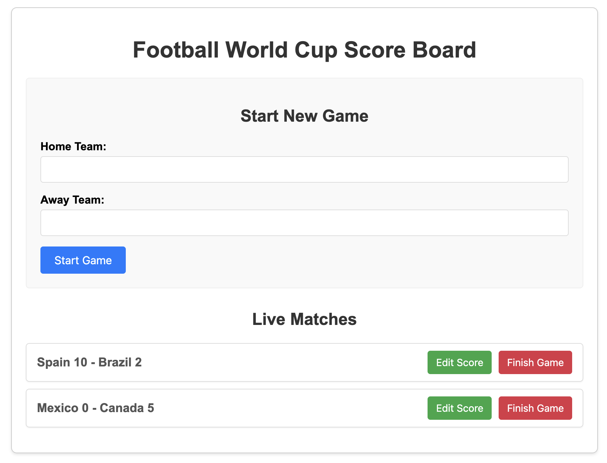

# Football World Cup Score Board

A live scoreboard application for football matches, displaying scores and ordering games by total score and recent activity.

## Features

* Start, update, and finish games.
* Validate inputs (e.g., no duplicate matches, valid scores).
* Dynamic sorting of live matches (total score then recent activity).

## Technologies

* **Frontend:** React.js
* **Build/Test:** Vite, Vitest
* **Core Logic:** Pure JavaScript class (Observer Pattern)

## Quick Start

1.  **Clone:** `git clone https://github.com/ilonasadouskaya/score-board.git && cd score-board`
2.  **Install:** `npm install`
3.  **Run App:** `npm run dev`
4.  **Run Tests:** `npm test`

---
